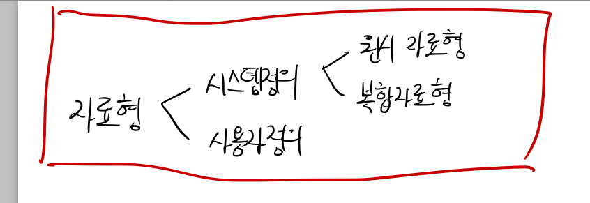

## Chapter 2

## 개관
-----

__1. 추상 자료형__

추상화 : 문제들을 단순화시키고 이를 해결하기 위해 보다 쉬운방법을 선택하는 능력
자료 추상화

자료 (data), 형식 (type), 연산 (operation), 자료형 (data type)

원시 자료형 (primitive data type) : 자료가 원자 값인 원소 그 자체
복합 자료형 (composite data type) : 자료형 내부에 또 다른 자료형을 포함할 수 있는 구조

__2. 객체지향 프로그래밍 소개__

추상 자료형을 구현하기 위해서 객체지향 방법 (object-oriented approach) 이용

__2-1 캡슐화와 자료 숨김__

*객체 (object)* = 자료값 + 연산

*클래스 (class)* = 객체를 생성하기 위해 사용. 필드 (자료값 저장) + 메소드 (연산)

*인스턴스 (instance)* = 클래스에 의해 생성되는 객체

*캡슐화 (encapsulation)* = 클래스의 내부에 존재하는 필드나 메소드들의 구현에 대해서 클래스 외부에서 불필요하게 파악할 수 없도록 하는 것

__2-2 상속__

새롭게 확장된 클래스는 원래의 클래스가 가지고 있는 필드와 메소드들을 그대로 모두 그대로 상속 받아서 마치 자기가 만든 클래스 처럼 사용할 수 있는 데 이것을 *상속 (inheritance)* 이라고 한다.

Super class = Base class

Sub class = derived class

*메소드 오버라이딩 (Method overriding)*

signature

__2-3 다형성__

*다형성 (polymorphism)* = 하나의 이름을 가진 메소드가 다른 클래스에서 여러 메소드들로 중복되어 나타날 수 있다는 의미

__3. Java 소개__ 

요건 생략
