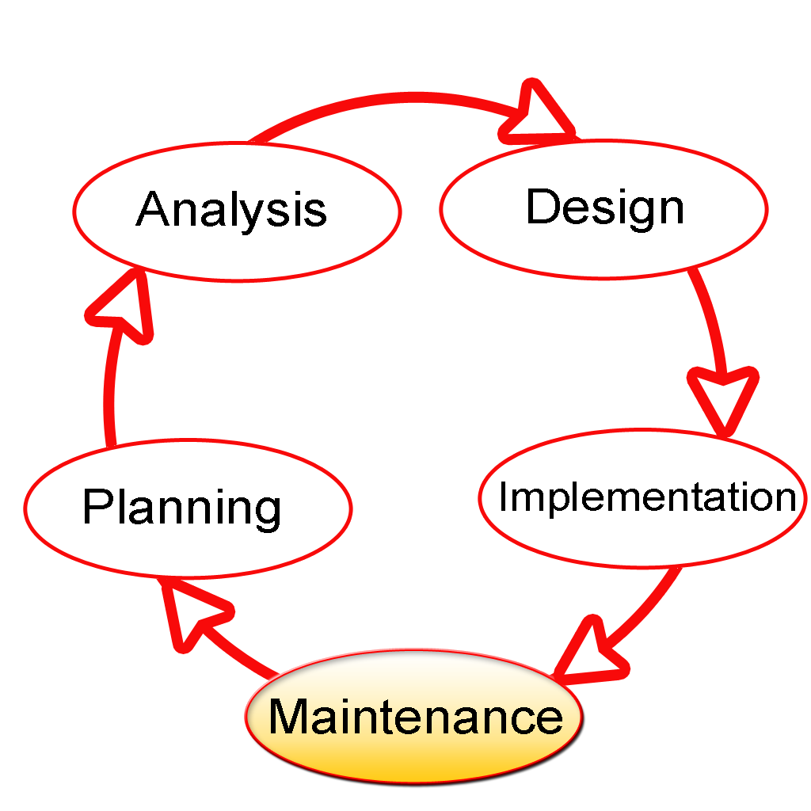

Chapter 1

## Introduction
-----

__1. 자료와 자료구조__

자료 : 현실세계로부터 단순한 관찰이나 측정을 통하여 수집한 사실이나 개념의 값들 또는 값들의 집합.
자료 구조 : 다루고자 하는 자료 원소들 (elements) 간의 논리적 관계를 기술, 컴퓨터의 내/외부에 물리적으로 구성되는 휘발성 또는 비휘발성 메모리에 존재하는 자료의 집합

자료구조 선택 기준
- 자료의 양
- 자료의 갱신 정도
- 자료의 활용 빈도 (저장 방식 결정)
- 사용가능한 기억 공간 (전체적인 메모리 공간)
- 처리 시간의 제한성
- 프로그램의 용이성

자료구조 선택 필요성
- 효율성
- 추상화
- 재사용성

__2. 알고리즘과 프로그램__

알고리즘 : 어떤 문제를 해결하기 위해 기술해 놓은 명확한 절차. 일련의 명령 집합

알고리즘의 요구조건
- 입력 (Input)
- 출력 (Output)
- 명백성 (Definiteness)
- 유한성 (Finiteness)
- 유효성 (Effectiveness)

대표적인 알고리즘
- 삽입
- 반복
- 검색/탐색
- 삭제/제거
- 순회
- 정렬

3. __소프트웨어 공학__

소프트웨어 공학 : 프로그램 작성 시 중요한 정확성과 효율성을 갖춰 진행하기 위한 원칙과 기술, 그리고 도구를 적용하는 방법론.

소프트웨어 생명주기 (Software life cycle)

